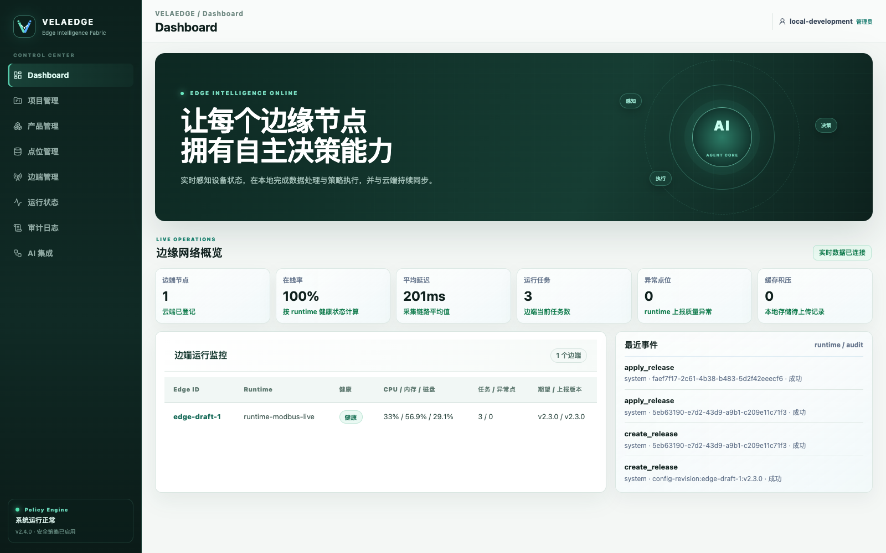
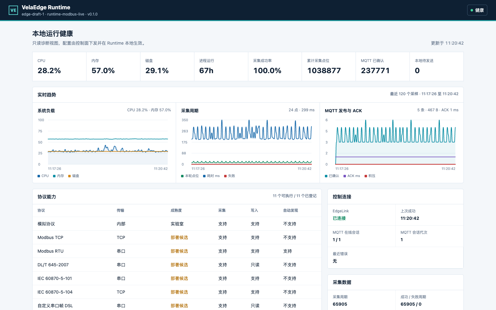

# VelaEdge

[English](README.md) | [简体中文](README.zh-CN.md)

VelaEdge 是云流科技使用 Rust 构建的边云一体化工业数据平台。系统由 Cloud 控制面和
Runtime 边缘执行面组成：Cloud 负责项目、产品、点位集、采集/指令编排、配置治理与运行
监控；Runtime 负责工业协议采集、确定性计算、本地存储、MQTT 上报和设备写入。Runtime
主动连接 Cloud，不要求边端开放管理入口。

## 系统截图

以下截图来自实际运行中的 Cloud 和 Runtime 进程，设备状态、主机资源、采集计数、协议
健康度及 MQTT 投递指标均来自实时接口，而非前端静态数据。

### Cloud 管理控制台



### Runtime 健康控制台



## 核心能力

- 产品化配置：项目隔离，产品复用点位集、协议连接、采集编排和指令编排。
- 工业协议：Modbus TCP/RTU、OPC UA、DL/T 645-2007、IEC 60870-5-101/104，并包含
  Siemens S7、Omron FINS、BACnet/IP 等适配与实验室验收能力。
- 数据编排：点位输入、窗口聚合、变化上报、死区过滤、表达式、分支和多 MQTT 输出。
- 指令编排：MQTT 下行消息映射到可写点位，并经过权限、范围、幂等和审计约束。
- 边端可靠性：RocksDB 配置与 Outbox、本地 JSONL、断线重连、指标采集和健康页面。
- 云端治理：SQLite 持久化、配置实时同步、运行监控、审计、MCP 工具与独立审批边界。

## 主要目录

- `crates/edge-core`：云边共享领域模型、配置包、遥测和指令契约。
- `crates/edge-runtime`：协议适配、采集与指令执行、RocksDB、EdgeLink、MQTT 和健康服务。
- `crates/cloud-control`：项目、产品、边端、配置与审计的领域服务和 SQLite 存储。
- `crates/cloud-api`：管理 API、静态控制台托管和 Runtime 主动连接的 EdgeLink 网关。
- `web/console`：React/Vite 管理控制台。
- `configs`：本地开发配置样例。
- `deploy`：生产配置、systemd、容器化工业设备实验室与演示清单。
- `docs`：架构、部署、控制台、MCP 与现场验收文档。

## Runtime 配置文件启动

Runtime 采用 TOML 配置文件优先的启动方式：

```bash
cp configs/edge.sample.toml configs/edge.local.toml

cargo run -p edge-runtime --bin edge-runtime -- \
  --config configs/edge.local.toml \
  --check-config

cargo run -p edge-runtime --bin edge-runtime -- \
  --config configs/edge.local.toml
```

`--check-config` 只执行启动前检查，不连接 Cloud 或设备。检查内容包括：

- TOML 结构和 `schema_version`；
- Edge/Runtime 标识、状态目录和健康监听地址；
- EdgeLink 与旧 HTTP 模式互斥关系；
- mTLS CA、客户端证书、私钥必须成组配置；
- Token 环境变量和证书文件是否可读取；
- 守护循环、重连周期和调度参数是否合法。

配置文件中的相对路径以 TOML 所在目录为基准。显式 CLI 参数优先于配置文件，适合临时
验收或故障诊断；常规部署应只传入 `--config`，减少冗长且容易泄露信息的进程参数。

### 配置职责边界

启动配置只描述 Runtime 进程如何运行：

- Edge、Runtime 和默认设备标识；
- RocksDB、JSONL 与只读健康页面路径/监听地址；
- Cloud EdgeLink 地址、守护循环、重连策略、Token 环境变量和 mTLS 身份；
- MQTT 子系统总开关及测试模拟开关。

下列业务配置不写入启动 TOML，而是由 Cloud 根据边端绑定的产品实时同步，并持久化到
Runtime RocksDB：

- Modbus、S7、FINS、OPC UA 等协议连接及设备地址；
- 点位集、点位地址、采集周期、数据类型和读写权限；
- 采集编排、计算节点、JSON 结构、MQTT Topic 和多路输出；
- 指令订阅、消息映射、可写点位、校验与安全策略。

本地样例见 [`configs/edge.sample.toml`](configs/edge.sample.toml)，生产样例见
[`deploy/config/runtime.toml.example`](deploy/config/runtime.toml.example)。敏感 Token 放入
权限为 `0600` 的 [`deploy/env/runtime.env.example`](deploy/env/runtime.env.example) 对应环境
文件，不应写入 TOML 或命令行。

## 本地启动

运行 Rust 测试：

```bash
cargo test --workspace
```

启动 Cloud API 与内置管理页面：

```bash
cargo run -p cloud-api
```

当前演示环境入口（端口可配置）：

- Cloud 管理控制台：`http://127.0.0.1:8082/`
- EdgeLink 网关：`127.0.0.1:18080`
- Runtime 健康控制台：`http://127.0.0.1:19090/`

端口可以通过 Cloud 环境变量或 Runtime TOML 调整。生产环境应在管理端入口启用 TLS 与
鉴权；Runtime 健康页默认仅监听回环地址。

## 真实协议实验室

启动独立的 Modbus TCP 设备容器：

```bash
docker compose -f deploy/modbus-device/compose.yaml up -d --build --wait
```

启动 Siemens S7、Omron FINS、IEC 104 和 BACnet/IP 设备实验室：

```bash
docker compose -f deploy/industrial-device-lab/compose.yaml up -d --build --wait
scripts/run-container-protocol-device-acceptance.sh
```

这些容器通过真实 TCP/UDP 协议栈提供持续变化的点位和可写指令点。它们适合端到端实验室
验收，但不能替代物理 PLC、仪表及现场串口链路的兼容性测试。

创建 Modbus、S7、FINS 三协议完整演示产品：

```bash
VELAEDGE_API_BASE=http://127.0.0.1:8082 scripts/bootstrap-industrial-demo.sh
```

演示会创建项目、产品、三套协议连接、点位集、采集多分支、多个 MQTT 输出和下行指令
编排，并绑定到测试边端。

## 生产部署

生产部署为每个边端安装一份 TOML 和一份仅包含敏感变量的环境文件：

```bash
install -m 0640 deploy/config/runtime.toml.example \
  /etc/edgeops/runtime/EDGE_ID.toml
install -m 0600 deploy/env/runtime.env.example \
  /etc/edgeops/runtime/EDGE_ID.env

/opt/edgeops/bin/edge-runtime \
  --config /etc/edgeops/runtime/EDGE_ID.toml \
  --check-config

systemctl enable --now edgeops-runtime@EDGE_ID
```

参考 systemd 服务会在每次启动前自动运行配置预检。完整的持久化目录、权限、Cloud
鉴权、mTLS、备份恢复和证书轮换说明见 [`docs/deployment.md`](docs/deployment.md)。

## 设计原则

1. Cloud 负责声明式配置，Runtime 负责确定性执行。
2. 配置保存后生成新修订并实时同步；不再依赖人工“配置发布”步骤。
3. Runtime 主动建立 EdgeLink 长连接，Cloud 不需要直接访问边端内网。
4. MQTT 用于业务数据上报和受控指令输入，Cloud 管理通道与 MQTT 数据通道相互独立。
5. AI/MCP 只能生成建议、查询状态或进入受控审批流程，边端策略始终是设备动作的最终门禁。
6. 模拟器与容器实验室用于验证软件链路，物理设备验收结果必须单独记录。

## 延伸文档

- [系统架构](docs/architecture.md)
- [Cloud 控制台](docs/cloud-console.md)
- [生产部署与恢复](docs/deployment.md)
- [MCP 集成与安全边界](docs/mcp-integration.md)
- [指令编排设计](docs/command-orchestration-design.md)
