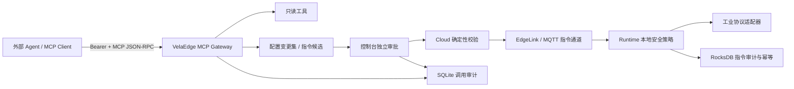

# VelaEdge MCP 能力网关

## 定位

VelaEdge 通过标准 MCP Streamable HTTP 向外部 Agent 暴露工业边缘管理能力。MCP
是能力边界，不是设备控制旁路：模型可以读取授权范围内的状态，也可以生成待审核的
配置变更集或设备指令候选，但不能直接应用配置、发布版本或写入工业设备。



## 接入端点

- MCP endpoint: `POST /mcp`
- 管理端状态: `GET /api/mcp/status`
- Transport: stateless Streamable HTTP
- JSON-RPC: `2.0`
- 协议版本: `2025-11-25`，兼容 `2025-03-26` 和 `2025-06-18`
- 认证: 沿用管理 API 的 Bearer Token RBAC
- 内容类型: `application/json`

服务不创建 SSE 会话，`GET /mcp` 返回 `405`。每次调用都是独立请求，因此外部 Agent
不能依赖服务端会话保存项目或边端作用域。

### 作用域请求头

| 请求头 | 用途 |
| --- | --- |
| `Authorization: Bearer ...` | 认证并确定 Viewer / Operator / Admin 角色 |
| `X-VelaEdge-Project-Id` | 将本次工具调用限制到指定项目 |
| `X-VelaEdge-Edge-Id` | 将本次工具调用限制到指定边端 |
| `Origin` | 浏览器或跨域客户端来源校验 |

服务端环境白名单优先于请求参数和请求头。工具参数不能扩大请求头作用域，也不能越过
`VELAEDGE_MCP_ALLOWED_PROJECTS` 或 `VELAEDGE_MCP_ALLOWED_EDGES`。

## 工具目录

### 只读工具

| 工具 | 能力 |
| --- | --- |
| `project.list` | 项目与作用域内资源计数 |
| `product.inspect` | 产品、版本、协议、点位与编排能力 |
| `configuration.inspect` | 产品或边端的完整脱敏配置 |
| `protocol.inspect` | 工业协议连接参数与引用关系 |
| `point_set.inspect` | 点位集、地址、权限、采样周期和数学处理 |
| `collection_flow.inspect` | 采集图、计算节点、多分支和 MQTT 输出 |
| `command_flow.inspect` | 指令图、可写点位与安全节点 |
| `runtime.metrics` | Runtime、协议、采集、存储与配置同步指标 |
| `mqtt.status` | 脱敏 MQTT 连接和 Runtime 投递指标 |
| `operations.diagnose` | 基于真实配置和指标的确定性诊断 |
| `audit.search` | 有界的作用域审计查询 |
| `knowledge.search` | 协议手册、运行手册与配置合同检索 |

### 仅生成草案的工具

| 工具 | 产物 | 后续动作 |
| --- | --- | --- |
| `configuration.change_set.draft` | SQLite 中的版本化配置变更集 | 独立操作者校验、模拟、确认、应用 |
| `device.command.draft` | SQLite 中的设备指令候选 | 独立操作者确认，Admin 才能下发 |

MCP 工具目录永远不注册 `apply`、`publish`、`dispatch`、协议写入或任意 Shell/SQL 工具。
即使 MCP 客户端伪造同名调用，也只会得到 `method/tool not found`，不会进入设备执行路径。

## RBAC 与审批

| 角色 | 读取工具 | 生成草案 | 确认 | 应用配置 / 下发指令 |
| --- | --- | --- | --- | --- |
| Viewer | 允许 | 拒绝 | 拒绝 | 拒绝 |
| Operator | 允许 | 允许 | 按管理 API 策略 | 拒绝高权限终态动作 |
| Admin | 允许 | 允许 | 允许 | 仅通过控制台/管理 API 明确操作 |

草案创建者不能独自完成需要职责分离的审核。高风险操作要求评审说明；需要双人复核的
候选必须记录第二位审批人。模型输出、知识库内容和 MCP 参数始终按不可信输入处理。

## Runtime 最终安全门

Cloud 通过审批后仍不能绕过 Runtime。启用 `require_confirmation` 的指令流要求载荷包含：

- 长度至少 24 且不含空白的 `confirmationToken`；
- 真实人工身份 `approvedBy`，拒绝 `agent:*`、`model:*` 和 `system`；
- RFC 3339 `approvedAt`，默认不得早于 15 分钟，可由
  `max_confirmation_age_ms` 收紧；
- 必填 `expiresAt`，且最长只允许未来 5 分钟；Cloud 当前签发 60 秒有效期；
- Cloud 生成的 `approvalCandidateId`，以及需要时的 `coApprovedBy`。

之后 Runtime 继续检查固定写点位、访问权限、类型和值域、来源白名单、滚动限流、命令
ID 幂等、协议响应或写后读结果。幂等与审计保存在 RocksDB，Cloud 审批和 MCP 调用保存在
SQLite。生产环境还必须用 MQTT ACL 或 EdgeLink mTLS 限制指令发布者。

## 配置

```bash
export EDGEOPS_API_AUTH_MODE=required
export EDGEOPS_VIEWER_TOKEN='viewer-token-at-least-24-characters'
export EDGEOPS_OPERATOR_TOKEN='operator-token-at-least-24-characters'
export EDGEOPS_ADMIN_TOKEN='admin-token-at-least-24-characters'

export VELAEDGE_MCP_ENABLED=true
export VELAEDGE_MCP_ALLOWED_ORIGINS='https://agent.example.com'
export VELAEDGE_MCP_ALLOWED_PROJECTS='plant-a,plant-b'
export VELAEDGE_MCP_ALLOWED_EDGES='edge-a-01,edge-b-01'
export VELAEDGE_MCP_RATE_LIMIT_PER_MINUTE=120
```

未设置 `VELAEDGE_MCP_ALLOWED_ORIGINS` 时，Cloud 只允许 loopback 来源，并会自动纳入
`EDGEOPS_HTTP_ADDR` 当前端口；非本机 Agent 或反向代理来源必须显式加入白名单。

生产部署应在 TLS 反向代理或身份感知网关后暴露 `/mcp`，单独签发最小角色 Token，限制
来源、项目和边端。不要把 Admin Token 放入浏览器 URL、提示词、知识库或客户端配置仓库。

## 调用示例

初始化：

```bash
curl -sS http://127.0.0.1:8080/mcp \
  -H 'Authorization: Bearer OPERATOR_TOKEN' \
  -H 'Content-Type: application/json' \
  -H 'X-VelaEdge-Project-Id: plant-a' \
  --data '{"jsonrpc":"2.0","id":1,"method":"initialize","params":{"protocolVersion":"2025-11-25","capabilities":{},"clientInfo":{"name":"ops-agent","version":"1.0.0"}}}'
```

读取工具目录：

```bash
curl -sS http://127.0.0.1:8080/mcp \
  -H 'Authorization: Bearer OPERATOR_TOKEN' \
  -H 'Content-Type: application/json' \
  --data '{"jsonrpc":"2.0","id":2,"method":"tools/list","params":{}}'
```

读取 Runtime 指标：

```bash
curl -sS http://127.0.0.1:8080/mcp \
  -H 'Authorization: Bearer VIEWER_TOKEN' \
  -H 'Content-Type: application/json' \
  -H 'X-VelaEdge-Project-Id: plant-a' \
  -H 'X-VelaEdge-Edge-Id: edge-a-01' \
  --data '{"jsonrpc":"2.0","id":3,"method":"tools/call","params":{"name":"runtime.metrics","arguments":{"edgeId":"edge-a-01"}}}'
```

响应同时返回 MCP `content` 文本和机器可读 `structuredContent`。草案工具成功后会返回
持久化 ID 与 `human_review_required`，可在管理端“AI 集成 > 审批中心”继续处理。

## 管理端

左侧“AI 集成”是 MCP 运维入口，而不是聊天机器人。页面展示当前 endpoint、协议版本、
鉴权与作用域、按角色过滤后的工具目录、待审批配置变更和设备指令、MCP 调用审计。
审批详情使用真实管理 API；应用和指令下发不会由页面加载、模型响应或工具调用自动触发。

## 审计与故障处理

每次工具调用记录主体、工具名、作用域和结果，包括成功、权限拒绝、作用域拒绝、执行失败
和草案持久化失败。速率限制按认证主体独立计算。遇到异常时：

1. 用 `GET /api/mcp/status` 确认功能、角色和可见工具。
2. 在“AI 集成 > 调用审计”按主体和工具定位失败。
3. 检查 Origin、Bearer 角色以及项目/边端白名单。
4. 配置草案先执行校验和模拟；设备指令确认前核对固定可写点位与 Runtime 在线状态。
5. 在 Runtime 健康页和 RocksDB 指令审计确认本地策略结果，不能只依据模型回答。
