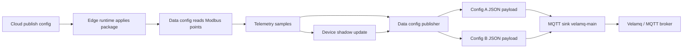

# Dynamic Data Configuration Design

## Goal

Support dynamic edge data configurations. A data configuration is the user-facing unit that defines one complete data flow:

```text
protocol collection + collection period + point mappings + MQTT JSON publishing
```

One edge runtime can run multiple data configurations at the same time. Each data configuration can collect a different group of Modbus points, package those points into one JSON payload, and publish that payload to its own MQTT topic.

Example target behavior:

```text
Data config A
-> Modbus connection: modbus-line-a
-> period: 1000ms
-> points: pressure, flow_rate, running
-> topic: factory/line1/pump/status
-> one JSON message

Data config B
-> Modbus connection: modbus-line-a
-> period: 5000ms
-> points: voltage_a, current_a, power
-> topic: factory/line1/pump/energy
-> one JSON message
```

The design must stay dynamically configurable from the cloud console and delivered to the edge runtime through the normal config package. Runtime execution remains deterministic and does not depend on Agent reasoning.

## Current Gap

The current model has `MqttUplinkConfig` as a global MQTT output and `publish_mqtt_samples` publishes one MQTT message per sample for every configured uplink. That shape is too coarse and produces fragmented messages.

It cannot express:

- One complete data-flow configuration that owns collection, point mapping, period, and MQTT publishing together.
- Multiple data configurations on one edge runtime.
- Different point groups going to different MQTT topics.
- One JSON payload containing multiple point values.
- Topic and payload shape per data configuration.
- Independent collection periods for different point groups.

Algorithms can create virtual points, but publish routing is not an algorithm. It is an output orchestration concern and should be modeled separately.

## Architecture Boundary

- Protocol connections define how runtime talks to devices, such as Modbus RTU serial settings or Modbus TCP endpoints.
- Data configurations define which points are collected, their protocol address mappings, collection period, payload shape, and MQTT publishing target.
- MQTT sinks define broker connectivity only: broker URL, client id, TLS/auth, QoS defaults, batching, and reconnect policy.
- Point mappings and collection tasks may still exist internally as normalized runtime structures, but the cloud console should present and edit them through data configurations.

This separation gives the user one coherent configuration object while keeping MQTT broker credentials reusable.

## Proposed Configuration Model

Extend `EdgeConfigPackage` with `data_configs`.

```rust
pub struct EdgeConfigPackage {
    pub mqtt_uplinks: Vec<MqttUplinkConfig>,
    pub data_configs: Vec<DataConfig>,
    pub point_mappings: Vec<TelemetryPointMapping>,
    pub collection_tasks: Vec<CollectionTask>,
}
```

`point_mappings` and `collection_tasks` can remain in the package during migration, but new cloud-authored configs should generate them from `data_configs`. Runtime should treat `data_configs` as the canonical execution source once the migration is complete.

`MqttUplinkConfig` remains the MQTT sink:

```json
{
  "sink_id": "velamq-main",
  "broker": "mqtts://velamq.local:8883",
  "client_id": "edge-dev-runtime-dev",
  "qos": 1,
  "batch_size": 100,
  "flush_interval_ms": 1000
}
```

New `DataConfig`:

```json
{
  "config_id": "pump_status",
  "name": "泵运行状态上报",
  "enabled": true,
  "device_id": "pump-1",
  "protocol_connection_id": "modbus-line-a",
  "collection": {
    "period_ms": 1000,
    "timeout_ms": 800,
    "retry_count": 2
  },
  "points": [
    {
      "point_id": "pressure",
      "semantic_id": "pump.pressure",
      "address": { "kind": "holding_register", "value": "40001" },
      "value_type": "float32",
      "unit": "MPa",
      "json_field": "pressure"
    },
    {
      "point_id": "flow_rate",
      "semantic_id": "pump.flow_rate",
      "address": { "kind": "holding_register", "value": "40003" },
      "value_type": "float32",
      "unit": "m3/h",
      "json_field": "flowRate"
    },
    {
      "point_id": "running",
      "semantic_id": "pump.running",
      "address": { "kind": "coil", "value": "00001" },
      "value_type": "bool",
      "unit": "-",
      "json_field": "running"
    }
  ],
  "publish": {
    "sink_id": "velamq-main",
    "topic_template": "factory/{site}/pump/{device_id}/status",
    "qos": 1,
    "payload": {
      "mode": "object",
      "timestamp_field": "ts",
      "include_quality": true
    }
  }
}
```

Second data configuration for another topic and period:

```json
{
  "config_id": "pump_energy",
  "name": "泵电参上报",
  "enabled": true,
  "device_id": "pump-1",
  "protocol_connection_id": "modbus-line-a",
  "collection": {
    "period_ms": 5000,
    "timeout_ms": 800,
    "retry_count": 2
  },
  "points": [
    {
      "point_id": "voltage_a",
      "semantic_id": "electric.voltage_a",
      "address": { "kind": "holding_register", "value": "40101" },
      "value_type": "float32",
      "unit": "V",
      "json_field": "voltageA"
    },
    {
      "point_id": "current_a",
      "semantic_id": "electric.current_a",
      "address": { "kind": "holding_register", "value": "40103" },
      "value_type": "float32",
      "unit": "A",
      "json_field": "currentA"
    },
    {
      "point_id": "power",
      "semantic_id": "electric.power",
      "address": { "kind": "holding_register", "value": "40105" },
      "value_type": "float32",
      "unit": "kW",
      "json_field": "power"
    }
  ],
  "publish": {
    "sink_id": "velamq-main",
    "topic_template": "factory/{site}/pump/{device_id}/energy",
    "qos": 1,
    "payload": {
      "mode": "object",
      "timestamp_field": "ts",
      "include_quality": true
    }
  }
}
```

This model intentionally repeats point mappings inside each data configuration. That makes the user's unit of work clear: creating, copying, disabling, publishing, and troubleshooting one data configuration covers the whole flow.

## Payload Modes

The first implementation should support two payload modes.

`object` mode emits one compact object:

```json
{
  "edge_id": "edge-dev",
  "device_id": "pump-1",
  "ts": "2026-06-30T10:30:00Z",
  "values": {
    "pressure": 0.82,
    "flowRate": 12.6,
    "running": true
  },
  "quality": {
    "pressure": "good",
    "flowRate": "good",
    "running": "good"
  }
}
```

`array` mode emits a point array for systems that prefer generic telemetry:

```json
{
  "edge_id": "edge-dev",
  "device_id": "pump-1",
  "ts": "2026-06-30T10:30:00Z",
  "points": [
    { "id": "pressure", "value": 0.82, "quality": "good" },
    { "id": "flow_rate", "value": 12.6, "quality": "good" }
  ]
}
```

The UI should default to `object` mode because the user explicitly wants a batch of points merged into one JSON object.

## Execution Modes

The MVP execution mode is simple and explicit:

- Each enabled data configuration has one collection period.
- Runtime reads the data configuration's point mappings when the period is due.
- Runtime immediately builds one JSON payload from that data configuration's collected values.
- Runtime publishes that payload to the data configuration's MQTT topic.

Later execution extensions can add change-only publishing or window aggregation, but those should be options inside a data configuration rather than separate top-level route objects.

## Runtime Data Flow



The runtime schedules each enabled data configuration independently. When a data configuration is due, it reads that configuration's points, updates device shadow, renders the topic template, builds one payload, and publishes through the referenced MQTT sink.

If a point in the data configuration fails to collect:

- MVP keeps the payload best-effort by default and includes quality for each point.
- A later `require_all_points` option can suppress publishing when any required point is missing.
- Runtime records a warning event with `config_id`, `point_id`, and failure reason.

## Validation Rules

Cloud validation must reject a config package when:

- `config_id` is empty or duplicated.
- `sink_id` does not match an existing MQTT sink.
- `protocol_connection_id` does not match an existing protocol connection.
- `device_id` does not match an existing device.
- Data configuration has no points.
- Point ids are duplicated inside one data configuration.
- Point addresses are invalid for the selected protocol.
- JSON field names are empty or duplicated inside one data configuration.
- Topic template is empty.
- Collection period is below the runtime minimum.

Warnings, not hard failures:

- Multiple data configurations use the same point id with different protocol addresses.
- Multiple data configurations publish to the same topic.
- A topic template variable may render empty.

## Cloud API

Add edge-scoped data configuration APIs:

- `GET /api/edges/{edge_id}/data-configs`
- `POST /api/edges/{edge_id}/data-configs`
- `PUT /api/edges/{edge_id}/data-configs/{config_id}`
- `DELETE /api/edges/{edge_id}/data-configs/{config_id}`

Release endpoints continue publishing a full `EdgeConfigPackage`. The desired config endpoint includes `data_configs`.

## Console Experience

Replace the current split configuration experience with a primary `数据配置` page and keep MQTT broker settings separate:

- `数据配置`: one complete flow containing collection period, protocol point mappings, JSON payload fields, and MQTT topic.
- `MQTT Sink`: reusable broker, TLS/auth, QoS, client id, reconnect/batch settings.

The `数据配置` page should be list-first:

- Config ID.
- Name.
- Protocol connection.
- Period.
- Point count.
- Sink.
- Topic.
- Status.
- Actions.

Clicking a data configuration opens a dialog editor. The editor should include:

- Basic data configuration info.
- Select protocol connection and device.
- Configure collection period, timeout, and retry count.
- Configure point mappings: point id, semantic id, address, value type, unit, JSON field.
- Configure topic template.
- Configure payload mode and quality inclusion.
- Preview JSON payload from sample/latest values.
- Save and validate.

Agent assistance can suggest data configurations from Modbus scan results, point names, and device models, but the user must save and publish the data configuration explicitly.

## Runtime Implementation Units

New edge runtime units:

- `DataConfigRunner`: schedules and executes each data configuration.
- `PointMappingResolver`: converts data config point entries into protocol adapter mappings.
- `DataConfigPublisher`: builds and publishes one MQTT message for one data configuration execution.
- `PayloadBuilder`: object/array JSON serialization.
- `TopicRenderer`: deterministic topic template rendering.

Existing `MqttPublisher` remains the transport abstraction.

`build_mqtt_publish_messages` should shift from per-sample expansion to data-config-based grouping:

```text
data_config + samples + package
-> build one JSON payload from data_config.points
-> render data_config.publish.topic_template
-> build one MqttPublishMessage for the data config
```

## Storage

Cloud SQLite stores data configurations inside edge draft packages for the MVP. This keeps versioning, validation, rollback, and release behavior aligned with the rest of the edge config package. A later migration may add a query-optimized `data_configs` table, but that is outside the MVP.

Runtime RocksDB should persist the full desired and active config package, including data configurations. Runtime state can later store last publish time and last values per `config_id`.

## Migration

Keep `MqttUplinkConfig.topic_template` during transition, but stop treating it as the primary routing mechanism. New cloud-authored packages should put MQTT topics inside each data configuration.

Migration behavior:

- Existing packages without `data_configs` continue to use existing point mappings, collection tasks, and old per-sample publishing for compatibility.
- New packages generated by the cloud console create explicit data configurations.
- Once data-config publishing is stable, the old per-sample fallback can be marked legacy.

## MVP Scope

Implement first:

- Core models: `DataConfig`, data config point entry, collection settings, publish settings, payload settings.
- Config package serialization and validation.
- Runtime data-config scheduler and one-message-per-config MQTT builder.
- Console data configuration list and dialog editor.
- Tests proving two data configurations publish two JSON messages to two topics.

Defer:

- Data configuration deletion audit UX beyond basic CRUD.
- Complex JSON templating language.
- Per-data-config TLS/auth overrides.
- Change-only publishing.
- Multi-sink fanout for one data configuration.

## Test Cases

Core tests:

- Config package serializes data configurations.
- Validator rejects data config with missing sink, missing protocol connection, missing device, invalid point, or duplicate JSON field.
- Topic renderer substitutes edge, device, config, and site variables.

Runtime tests:

- One edge package with two Modbus data configurations publishes two MQTT messages.
- Data config A payload contains only its configured point group.
- Data config B payload contains only its configured point group.
- Missing point value does not crash runtime and is represented with bad quality or omitted according to payload settings.
- Disabled data configuration produces no message.

Console tests:

- Data configuration list renders API-backed configurations.
- New data configuration dialog saves collection period, point mappings, JSON fields, sink, and topic.
- Edit data configuration dialog updates fields and preview.
- MQTT Sink page remains broker-focused and no longer implies global point routing.
