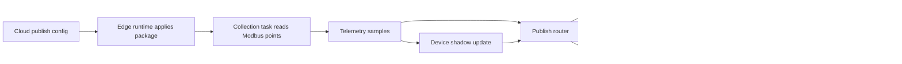

# Dynamic MQTT Publish Routes Design

## Goal

Support dynamic telemetry publishing where one edge runtime can collect many Modbus points, split them into multiple logical point groups, serialize each group into a JSON payload, and publish each payload to its own MQTT topic.

Example target behavior:

```text
Modbus task reads: pressure, flow_rate, running, voltage_a, current_a, power

Route A publishes pressure + flow_rate + running
-> topic factory/line1/pump/status
-> one JSON message

Route B publishes voltage_a + current_a + power
-> topic factory/line1/pump/energy
-> one JSON message
```

The design must stay dynamically configurable from the cloud console and delivered to the edge runtime through the normal config package. Runtime execution remains deterministic and does not depend on Agent reasoning.

## Current Gap

The current model has `MqttUplinkConfig` as a global MQTT output and `publish_mqtt_samples` publishes one MQTT message per sample for every configured uplink. That shape is too coarse and produces fragmented messages.

It cannot express:

- Different point groups going to different MQTT topics.
- One JSON payload containing multiple point values.
- Topic routing independent of protocol connection.
- Payload shape and trigger policy per route.
- Multiple publishing policies for the same collected sample set.

Algorithms can create virtual points, but publish routing is not an algorithm. It is an output orchestration concern and should be modeled separately.

## Architecture Boundary

- Protocol connections define how runtime talks to devices, such as Modbus RTU serial settings or Modbus TCP endpoints.
- Point mappings define how semantic point ids map to protocol addresses.
- Collection tasks define when and which point ids are collected together.
- Publish routes define how collected samples are grouped, encoded, and published.
- MQTT sinks define broker connectivity only: broker URL, client id, TLS/auth, QoS defaults, batching, and reconnect policy.

This separation keeps Modbus collection reusable while allowing flexible northbound MQTT publishing.

## Proposed Configuration Model

Extend `EdgeConfigPackage` with `publish_routes`.

```rust
pub struct EdgeConfigPackage {
    pub mqtt_uplinks: Vec<MqttUplinkConfig>,
    pub point_mappings: Vec<TelemetryPointMapping>,
    pub collection_tasks: Vec<CollectionTask>,
    pub publish_routes: Vec<PublishRouteConfig>,
}
```

`MqttUplinkConfig` remains the MQTT sink:

```json
{
  "sink_id": "velamq-main",
  "broker": "mqtts://velamq.local:8883",
  "client_id": "edge-dev-runtime-dev",
  "qos": 1,
  "batch_size": 100,
  "flush_interval_ms": 1000
}
```

New `PublishRouteConfig`:

```json
{
  "route_id": "pump_status_route",
  "enabled": true,
  "source_task_ids": ["pump-main"],
  "point_ids": ["pressure", "flow_rate", "running"],
  "sink_id": "velamq-main",
  "topic_template": "factory/{site}/pump/{device_id}/status",
  "payload": {
    "mode": "object",
    "timestamp_field": "ts",
    "include_quality": true,
    "fields": [
      { "name": "pressure", "point_id": "pressure" },
      { "name": "flowRate", "point_id": "flow_rate" },
      { "name": "running", "point_id": "running" }
    ]
  },
  "trigger": {
    "type": "on_collection"
  }
}
```

Second route for another topic:

```json
{
  "route_id": "pump_energy_route",
  "enabled": true,
  "source_task_ids": ["pump-main"],
  "point_ids": ["voltage_a", "current_a", "power"],
  "sink_id": "velamq-main",
  "topic_template": "factory/{site}/pump/{device_id}/energy",
  "payload": {
    "mode": "object",
    "timestamp_field": "ts",
    "include_quality": true,
    "fields": [
      { "name": "voltageA", "point_id": "voltage_a" },
      { "name": "currentA", "point_id": "current_a" },
      { "name": "power", "point_id": "power" }
    ]
  },
  "trigger": {
    "type": "periodic",
    "interval_ms": 5000
  }
}
```

## Payload Modes

The first implementation should support two payload modes.

`object` mode emits one compact object:

```json
{
  "edge_id": "edge-dev",
  "device_id": "pump-1",
  "ts": "2026-06-30T10:30:00Z",
  "values": {
    "pressure": 0.82,
    "flowRate": 12.6,
    "running": true
  },
  "quality": {
    "pressure": "good",
    "flowRate": "good",
    "running": "good"
  }
}
```

`array` mode emits a point array for systems that prefer generic telemetry:

```json
{
  "edge_id": "edge-dev",
  "device_id": "pump-1",
  "ts": "2026-06-30T10:30:00Z",
  "points": [
    { "id": "pressure", "value": 0.82, "quality": "good" },
    { "id": "flow_rate", "value": 12.6, "quality": "good" }
  ]
}
```

The UI should default to `object` mode because the user explicitly wants a batch of points merged into one JSON object.

## Trigger Modes

Initial trigger modes:

- `on_collection`: publish when a source collection task succeeds.
- `periodic`: publish latest values at a route-specific interval.
- `on_change`: publish when any selected point changes beyond configured deadband.

MVP should implement `on_collection` first. `periodic` can reuse the latest device shadow values. `on_change` can follow after deadband and previous-value tracking are stable.

## Runtime Data Flow



The publish router receives the collection result with task id context. It matches enabled routes whose `source_task_ids` contain that task id, selects samples by `point_ids`, renders the topic template, builds one payload per route, and publishes through the referenced MQTT sink.

If a route needs a point that was not collected in the current task:

- `on_collection` skips missing fields by default and marks route result as partial.
- A route option can later require all fields and suppress the publish when fields are missing.
- `periodic` can fill from `DeviceShadow` because it is based on latest known values.

## Validation Rules

Cloud validation must reject a config package when:

- `route_id` is empty or duplicated.
- `sink_id` does not match an existing MQTT sink.
- `source_task_ids` reference missing collection tasks.
- `point_ids` reference missing point mappings.
- Payload field `point_id` is not included in the route point set.
- Topic template is empty.
- Trigger interval is below the runtime minimum.

Warnings, not hard failures:

- A route references points from multiple devices.
- A route references points collected by tasks with very different intervals.
- A route uses a topic template variable that may render empty.

## Cloud API

Add edge-scoped publish route APIs:

- `GET /api/edges/{edge_id}/publish-routes`
- `POST /api/edges/{edge_id}/publish-routes`
- `PUT /api/edges/{edge_id}/publish-routes/{route_id}`
- `DELETE /api/edges/{edge_id}/publish-routes/{route_id}`

Release endpoints continue publishing a full `EdgeConfigPackage`. The desired config endpoint includes `publish_routes`.

## Console Experience

Rename or extend the current `MQTT 上报` navigation area into two clear pages or tabs:

- `MQTT Sink`: broker, TLS/auth, QoS, client id, reconnect/batch settings.
- `上报路由`: point group, source task, JSON structure, trigger, topic.

The `上报路由` page should be list-first:

- Route ID.
- Source task.
- Point count.
- Sink.
- Topic.
- Trigger.
- Status.
- Actions.

Clicking a route opens a dialog editor. The editor should include:

- Basic route info.
- Select source task.
- Select point ids from that task.
- Configure topic template.
- Configure payload field names and ordering.
- Preview JSON payload from sample/latest values.
- Save and validate.

Agent assistance can suggest routes from point names and device models, but the user must save and publish the route explicitly.

## Runtime Implementation Units

New edge runtime units:

- `PublishRouter`: route matching and orchestration.
- `PayloadBuilder`: object/array JSON serialization.
- `TopicRenderer`: deterministic topic template rendering.
- `RouteScheduler`: periodic/on-change trigger state in a later phase.

Existing `MqttPublisher` remains the transport abstraction.

`build_mqtt_publish_messages` should shift from per-sample expansion to route-based grouping:

```text
samples + task_id + package
-> match publish_routes
-> group selected samples per route
-> build one MqttPublishMessage per route
```

## Storage

Cloud SQLite stores publish routes inside edge draft packages for the MVP. This keeps versioning, validation, rollback, and release behavior aligned with the rest of the edge config package. A later migration may add a query-optimized `publish_routes` table, but that is outside the MVP.

Runtime RocksDB should persist the full desired and active config package, including publish routes. Periodic/on-change route state can later store last publish time and last values.

## Migration

Keep `MqttUplinkConfig.topic_template` during transition, but stop treating it as the primary routing mechanism.

Migration behavior:

- Existing packages without `publish_routes` continue to publish using the old per-sample behavior for compatibility.
- New packages generated by the cloud console create explicit default routes.
- Once route-based publishing is stable, the old per-sample fallback can be marked legacy.

## MVP Scope

Implement first:

- Core models: `PublishRouteConfig`, payload config, route trigger.
- Config package serialization and validation.
- Runtime route-based message builder for `on_collection`.
- Console route list and dialog editor.
- Tests proving two point groups publish two JSON messages to two topics.

Defer:

- Route deletion audit UX beyond basic CRUD.
- Complex JSON templating language.
- Per-route TLS/auth overrides.
- `on_change` route trigger.
- Multi-sink fanout for one route.

## Test Cases

Core tests:

- Config package serializes publish routes.
- Validator rejects route with missing sink, missing task, or missing point.
- Topic renderer substitutes edge, device, task, route, and site variables.

Runtime tests:

- One Modbus task with six samples and two routes publishes two MQTT messages.
- Route A payload contains only its configured point group.
- Route B payload contains only its configured point group.
- Missing point in `on_collection` route does not crash runtime.
- Disabled route produces no message.

Console tests:

- Route list renders API-backed routes.
- New route dialog saves user-selected point group and topic.
- Edit route dialog updates fields and preview.
- MQTT Sink page remains broker-focused and no longer implies global point routing.
